This is a **Discover** project, this project will help you explore what the **micro:bit** can do and decide whether you want to learn more. 

### What you will make

Do you ever find yourself wondering what to do with your free time? You can use the micro:bit to help you make those decisions. 

In this project you are going to make a **random hobby selector**. 

You will: 
+ Use variables to store data
+ Draw icons to the LEDs
+ Use `if... then` blocks to select which icons to show
+ Use gestures and buttons
+ Randomly choose a hobby

### Opening MakeCode

To get started creating your micro:bit project, you will need to open the MakeCode editor.

--- task ---

Open the MakeCode editor at [makecode.microbit.org](https://makecode.microbit.org)

--- collapse ---

---
title: Offline version of the editor
---

There is also a [downloadable version of the MakeCode editor](https://makecode.microbit.org/offline-app).

--- /collapse ---

--- /task ---

Once the editor is open, you will need to create a New Project and give your project a name. 

--- task ---

Click on the **New Project** button.

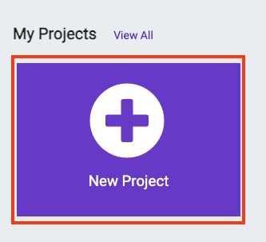

--- /task ---

--- task ---

Give your new project the name `hobby-selector` and click **Create**.

**Tip:** Give your project a helpful name that relates to the activity you’re creating. This will make it easier to find if you create other projects on MakeCode.

--- /task ---

### The MakeCode Editor

Created by the micro:bit Foundation, the **MakeCode editor** has everything you need to get started coding on micro:bit. 

On the left side there is a **simulator**, this contains a virtual micro:bit that you can use to test your code! 

It has all the features and buttons found on a V2 micro:bit, including:
+ LED Display
+ Speaker
+ Microphone
+ Input buttons
    + A
    + B
    + Logo

In the centre there is the **blocks panel** which is colour coded and allows you to access various code blocks.

On the right side there is a main **code editor panel** to drag and drop blocks into when creating your program.

### Show Icon

The MakeCode editor panel already contains two blocks: `on start` and `forever`.

You are going to use the `forever` block to see how the LEDs on the simulator work.

--- task ---

Click on the Basic blocks in the Blocks panel. This will expand to show you the groups of blocks available.

Drag the `show icon` block and place it **inside** the `forever` block. 

This should fit in place like a puzzle.

--- /task ---

--- task ---

Click the down arrow on the show icon block and choose any icon of your choice.

In this example we have chosen the `X` icon.

--- /task ---

--- task ---

**Test:** Click the play button on the emulator, the LED display should light up, showing your chosen icon.

Well done for getting the micro:bit to do something!

--- /task ---

### Choose your hobbies. 

--- task ---

Choose 3 hobbies/activities you like to do in your spare time. 

If you can't think of some here are some ideas to  get you started:
+ Gaming
+ Reading
+ Baking
+ Watching TV
+ Going for a walk
+ Playing a sport
+ Drawing

--- /task ---

--- task ---

Change your icon to one that represents your first hobby. 

--- /task ---

### Creating a variable

Create a variable that will be used to decide which activity you do. 

--- task ---

Open the `Variables` block menu, and click **Make a variable**.

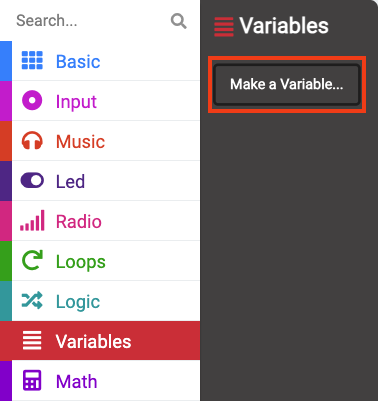

--- /task ---

--- task ---

Call your new variable `activity`. 

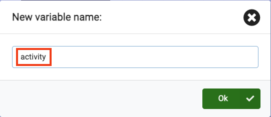

--- /task ---

You will now see that there are new blocks you can use to call on and change the value stored in the `activity` variable. 

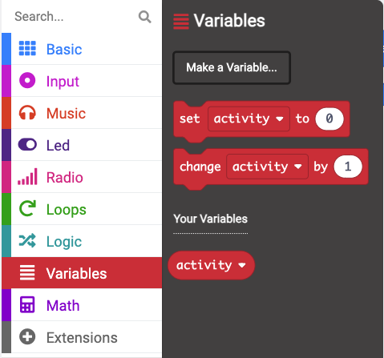

--- task ---

Drag the `set [activity] to 0` block inside of the `onstart` block.

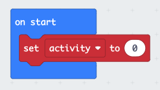

--- /task ---

### Which hobby will it be?

Next you are going to add the code that will show which activity the micro:bit has chosen. 

You will use `if... then` blocks to do this. 

--- task ---

Open the **Logic** menu and choose the `if 'true' then` block. 

Drag it inside the `forever` loop block **above** your icon block. 

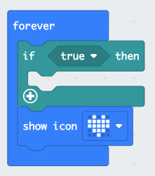

--- /task ---

Now you are going to make it so that your icon shows only if activity is set to `1`.

--- task ---

Open the **Logic** menu and grab the `0 '=' 0` **condition block**. 

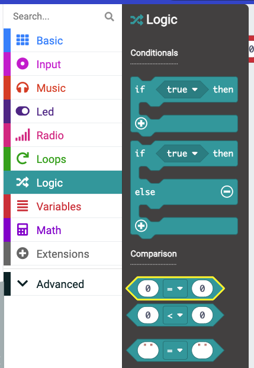

Drag that over the `true` part of your `if` block and place it down. 

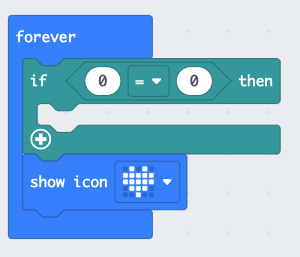

--- /task ---

--- task ---

Head back to the **Variables** menu and grab the small block that says `activity`. 

Drag that block to the **first** 0 in your new condition block. 

Change the `0` to a 1.

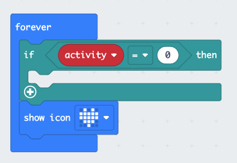

--- /task ---

--- task ---

Drag your `show leds` block **inside** the `if... then` block. 

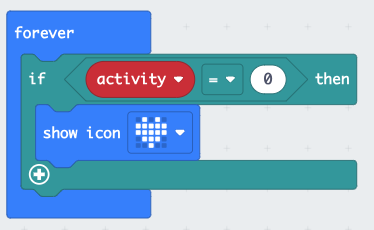

--- /task ---

--- task ---

**Test** Run your program, you should see that nothing appears on the LEDs.

**Change** the value in your `set 'activity' to 0` to set the variable to `1` instead.

**Run** the program again and you should see the icon appear. 

**Make sure to change activity back to `0` afterwards.**

--- /task ---

### Adding more hobbies

To add more hobby options to your program, you will need to add more conditions to your `if... then` block.

--- task ---

Click on the `+` symbol at the bottom of the `if... then` block. This will create an `else` block. 

--- /task ---

--- task ---

Click on the `+` symbol below the  `else` block. This will create an `else if... then` block. Do this one more time so you have two `else if... then` blocks.

--- /task ---

--- task ---

Now remove the `else` block, click on the `-` symbol next to the `else` block.

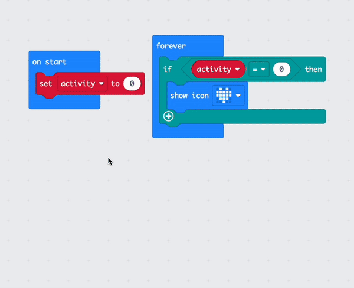

--- /task ---

--- task ---

Right click on the `condition` block. Click `Duplicate` to make a copy of it.

--- /task ---

--- task ---

Drag the duplicated `condition` block into the first `else if... then` block. Then change the number `1` to a `2`.

--- /task ---

--- task ---

Duplicate the `condition` one more time and drag it into the second `else if... then` block. Then change the number to a `3`.

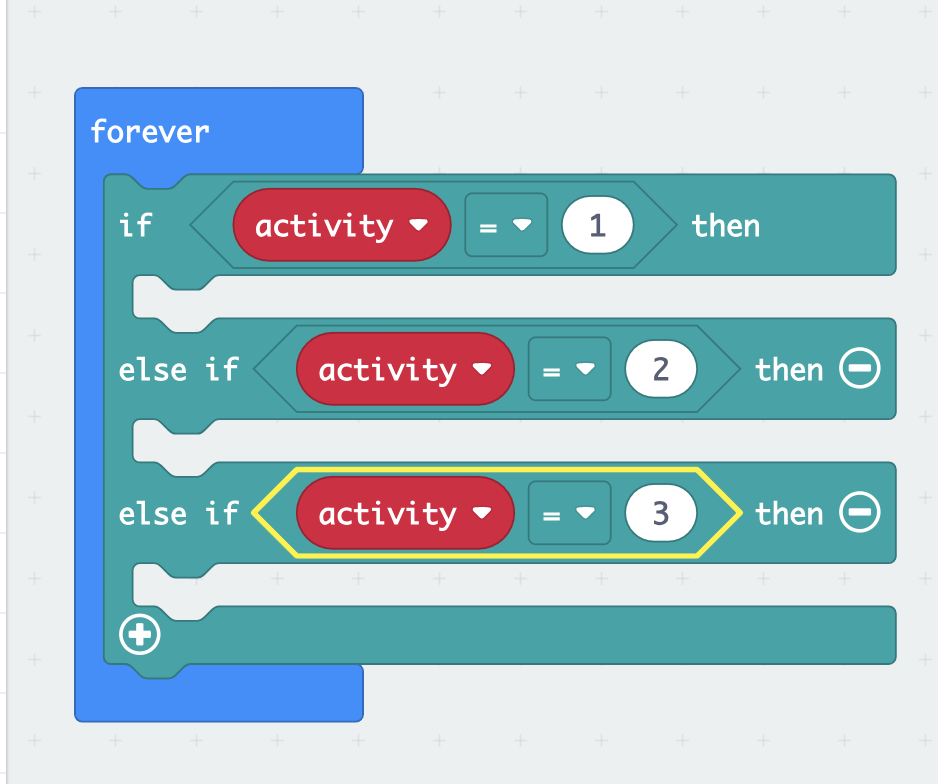

--- /task ---

### Styling your hobbies

You will select more icons to represent the hobbies that the device will randomise for you. 

--- task ---

**Choose:** Three pictures to represent your hobbies.

You can use the `show icon` block or create your own icon using the `show leds` block.

--- collapse ---

---
title: Using the show leds block
---

Inside the `Basic` menu, drag the `show leds` block below an `else if... then` block to use it.

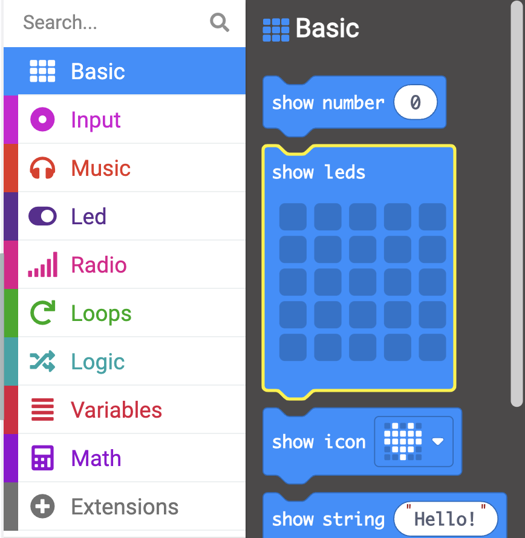

You can click on each of the squares to draw your picture.

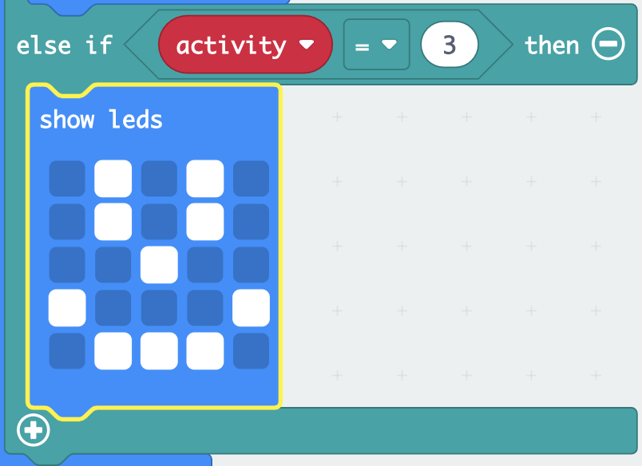

--- /collapse ---

--- /task ---

### Choose a random hobby

Use the `shake` gesture to randomly select a hobby for you.

--- task ---

Drag the `on shake` block from the `input` menu.

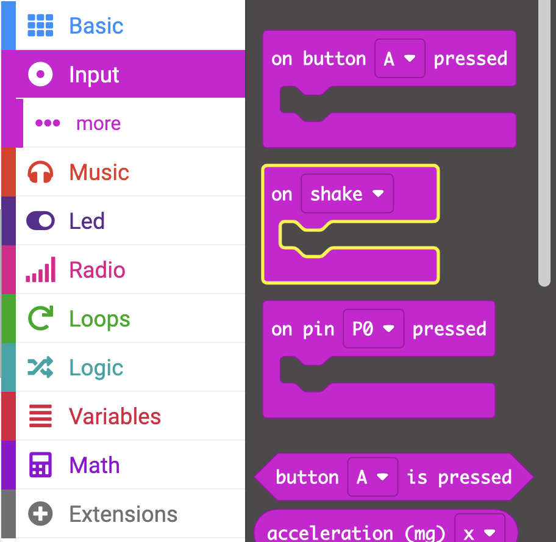

--- /task ---

--- task ---

From the `variables` menu, drag the `set activity` block inside the `on shake` block.

--- /task ---

--- task ---

From the `math` menu, drag the `pick random 0 to 10` block. Place it inside the `set activity` block.

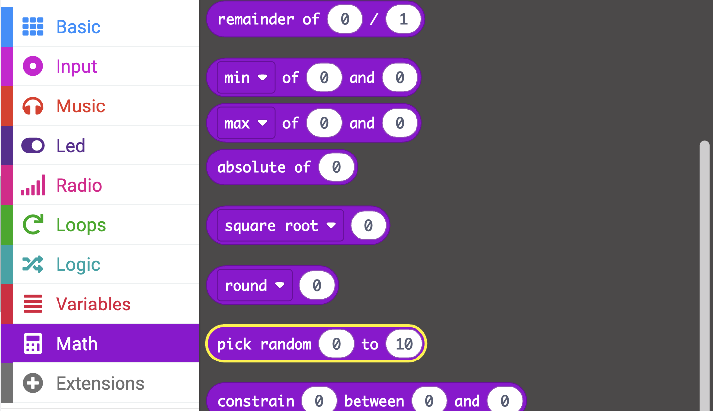

Change the numbers from `0 to 10` to `1 to 3`.

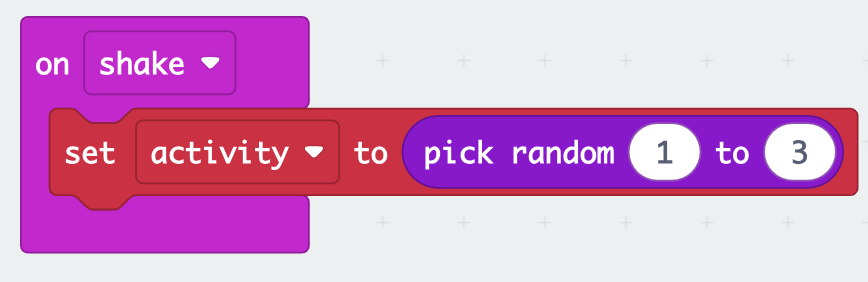

--- /task ---

### Clear the screen

Clear the screen if you want to randomise a new hobby.

--- task ---

Use the `on logo pressed` block from the `input` menu.

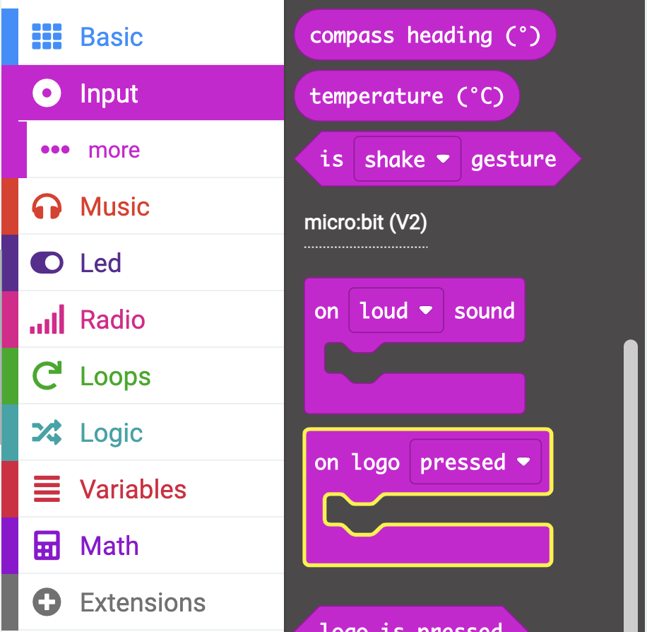

--- collapse ---

---
title: V1 microbit users
---

The logo button is only available on the V2 of the micro:bit. Instead, use the `on button A pressed` block from the `input` menu.

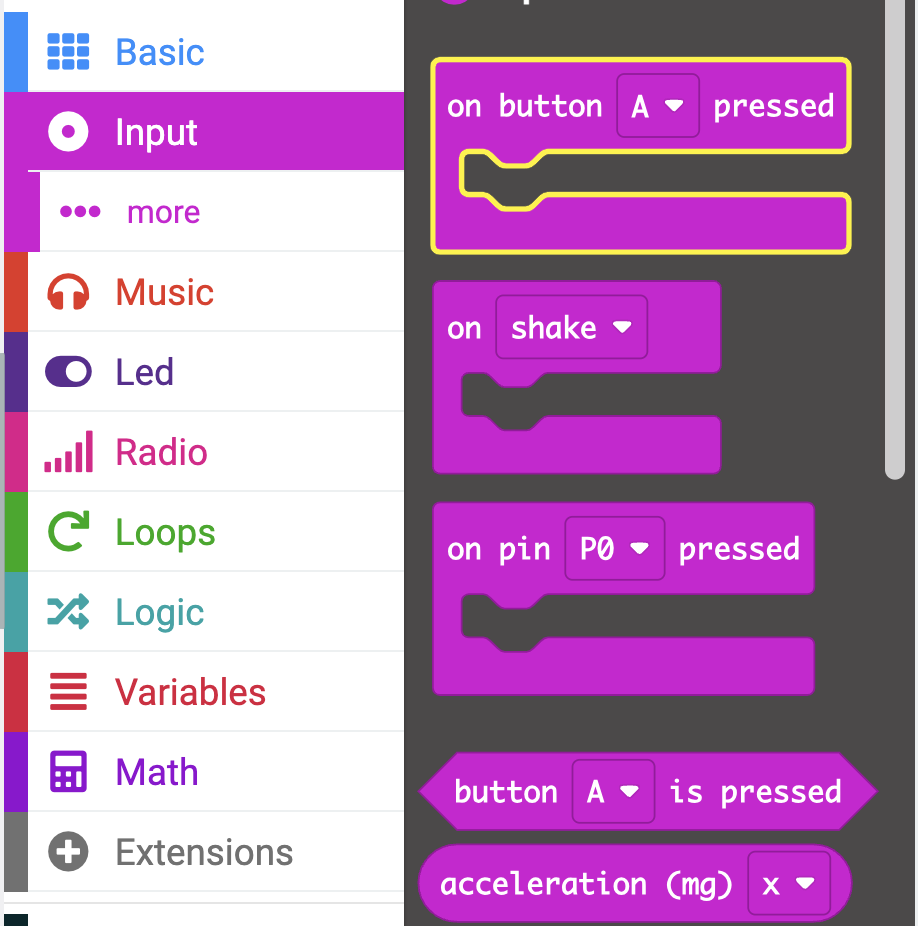

--- /collapse ---

--- /task ---

--- task ---

Drag the `clear screen` block from the `basic` menu and place it inside the `on logo pressed` block.

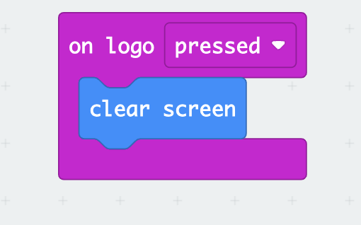

--- /task ---

--- task ---

Now drag the `set activity` block from the `variables` menu and place it below the `clear screen` block. 

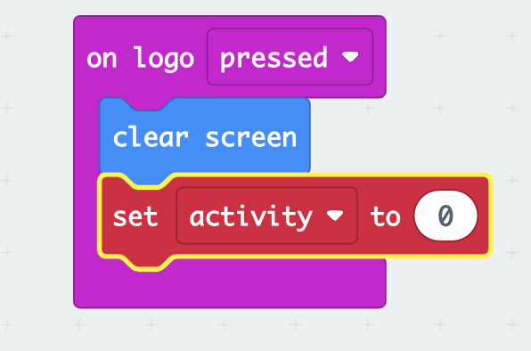

--- /task ---

--- task ---
**Run** the program to check that all your code is working. 

**Click** the shake icon on the microbit to randomly choose a hobby. 

**Press** the logo or A button to make sure the screen clears. 

--- /task ---

--- save --- 

### Uploading your program to the micro:bit

**Save** and download your code so you can test it out on a physical micro:bit.

--- task ---

Click on the `Download` button below the micro:bit simulator. 

You will be asked to plug in your micro:bit, do that now, then click **Continue**. 

Now to Pair your micro:bit, click **Pair** and select your device from the list that appears, then click **Connect**.

--- collapse ---

---
title: My microbit won't pair
---

If your micro:bit won't pair using the method above, it will download the program for you. 

**Windows:** Open **File Explorer** and check that you can see `MICROBIT` under `This PC` on the left hand side. If it is there, drag the downloaded `.HEX` file into the micro:bit, your program will upload onto the device and you should be able to use it. 

**MacOS:** Open **Finder** and check that you can see `MICROBIT` under `Locations` on the left hand side. If it is there, drag the downloaded `.HEX` file into the micro:bit, your program will upload onto the device and you should be able to use it.

If the device isn't showing up, try unplugging it and plugging it back in. You can also try a different USB slot or USB cable if they are available.

--- /collapse ---

--- /task ---

--- task ---

**Test** Run your program on the physical micro:bit. You should now see icons randomly chosen when you shake the device.

--- /task ---

### Upgrade your project

You can upgrade your project to make it more engaging by doing the following:

+ Add more hobbies so you can have a wider range to choose from.
+ Increase the number of `else if... then` blocks so you can add more icons
+ Increase the random range to more than three to match adding more hobbies
+ Add a timer countdown to track each hobby you complete.
