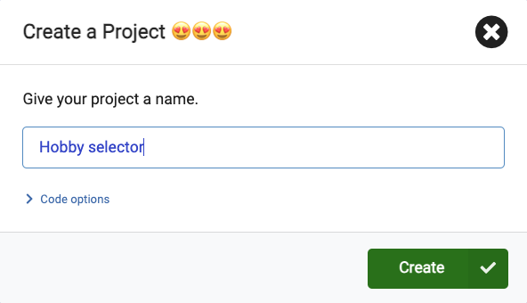
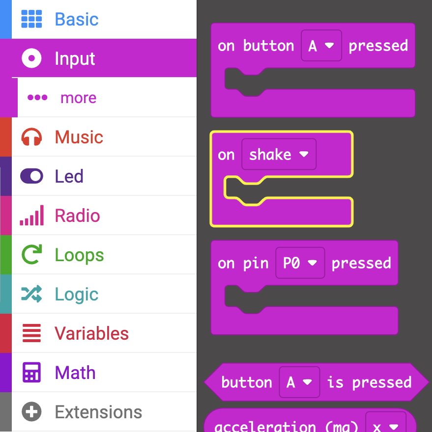

The **micro:bit** is a small computer that you can use to interact with the world around you.

This project will help you **discover** what the **micro:bit** can do before you go on to explore it in more detail. 

### What you will make

Do you ever find yourself wondering what to do with your free time? You can use the micro:bit to help you make those decisions. 

In this project, you are going to make a **random hobby selector**. 

You will: 
+ Light up the micro:bit to display images
+ Use random numbers to make choices
+ Use <code style="background-color: #00A4A6">if</code> blocks to control which images are displayed
+ Use the logo or a button to clear the display

--- no-print ---

### Play ▶️

--- task ---

What happens if you **shake** the micro:bit?
What happens if you click the **logo**?

<iframe style="position:absolute;top:0;left:0;width:100%;height:100%;" src="https://makecode.microbit.org/---run?id=_gsk7kk1AJWXy" allowfullscreen="allowfullscreen" sandbox="allow-popups allow-forms allow-scripts allow-same-origin" frameborder="0"></iframe>

--- /task ---

--- /no-print ---

### Opening MakeCode

To get started creating your micro:bit project, you will need to open the MakeCode editor.

--- task ---

Open the MakeCode editor at [makecode.microbit.org](https://makecode.microbit.org)

--- collapse ---

---
title: Offline version of the editor
---

There is also a [downloadable version of the MakeCode editor](https://makecode.microbit.org/offline-app).

--- /collapse ---

--- /task ---

Once the editor is open, you will need to create a New Project and give your project a name. 

--- task ---

Click on the **New Project** button.

--- /task ---

--- task ---

Give your new project the name `Hobby selector` and click **Create**.

**Tip:** Give your project a helpful name that relates to the activity you’re creating. This will make it easier to find if you create other projects on MakeCode.

--- /task ---

### The MakeCode editor

Created by the micro:bit Foundation, the **MakeCode editor** has everything you need to get started coding on micro:bit. 

On the left side, there is a **simulator**, this contains a virtual micro:bit that you can use to test your code! 

It has all the features and buttons found on a V2 micro:bit, including:
+ LED display
+ Speaker
+ Microphone
+ Input buttons
    + A
    + B
    + Logo

In the centre, there is the **blocks panel**, which is colour-coded and allows you to access various code blocks.

On the right side, is the **code editor panel** to drag and drop blocks into when creating your program.

The MakeCode editor panel already contains two blocks: <code style="background-color: #1e90ff">on start</code> and <code style="background-color: #1e90ff">forever</code>.

### Show icon

You are going to use the <code style="background-color: #1e90ff">forever</code> block to see how the LEDs on the simulator work.

--- task ---

Click on the <code style="background-color: #1E90FF">Basic</code> block menu in the Blocks panel. This will expand to show you the blocks available.

Drag the <code style="background-color: #1e90ff">show icon</code> block and place it **inside** the <code style="background-color: #1e90ff">forever</code> block. 

This should fit in place like a puzzle piece.

<iframe style="position:relative;top:0;left:0;width:75%;height:100%;" src="https://makecode.microbit.org/---codeembed#pub:_iVKhocCVxR3f" allowfullscreen="allowfullscreen" frameborder="0" sandbox="allow-scripts allow-same-origin"></iframe>

--- /task ---

--- task ---

Click the down arrow on the show icon block and choose any icon of your choice.

--- /task ---

--- task ---

**Test:** Click the play button on the simulator. The LED display should light up, showing your chosen icon.

In this example, we have chosen the `X` icon.

Well done for getting the micro:bit to do something!

--- /task ---

### Choose your hobbies 

--- task ---

Choose three hobbies/activities you like to do in your spare time. 

If you can't think of some, here are some ideas to get you started:
+ 🎮 Gaming
+ 📚 Reading
+ 🧁 Baking
+ 📺 Watching TV
+ 🚶‍♀️ Going for a walk
+ 🏐 Playing a sport 
+ 🎨 Drawing

--- /task ---

--- task ---

Change your icon to one that represents your first hobby. 

We chose a Pac-Man ghost to represent gaming! 👻

--- /task ---

### Creating a variable

You are going to use icons to represent the three different hobbies.

Each hobby will be linked to a unique number.

You will need to create a variable so you can change which hobby is displayed.

--- task ---

Open the <code style="background-color: #DC143C">Variables</code> menu, and click **Make a variable**.

--- /task ---

--- task ---

Name the new variable `activity`, then click the **OK** button.

--- /task ---

You will now see that there are new blocks you can use to set, change, or use the value stored in the `activity` variable. 

--- task ---

Drag the <code style="background-color: #dc143c">set</code> block inside the <code style="background-color: #1e90ff">on start</code> block.

<iframe style="position:relative;top:0;left:0;width:100%;height:100%;" src="https://makecode.microbit.org/---codeembed#pub:_YbT2My3k2aXu" allowfullscreen="allowfullscreen" frameborder="0" sandbox="allow-scripts allow-same-origin"></iframe>

--- /task ---

### Which hobby will display?

A different icon should display if <code style="background-color: #DC143C">activity</code> is set to `1`, than if <code style="background-color: #DC143C">activity</code> is set to `2`.

You will use `if... then` blocks to do this. 

--- task ---

Open the <code style="background-color: #00A4A6">Logic</code> menu and choose the <code style="background-color: #00a4a6">if</code> block. 

Drag it inside the `forever` loop block **above** your icon block. 

<iframe style="position:relative;top:0;left:0;width:100%;height:100%;" src="https://makecode.microbit.org/---codeembed#pub:_3fXJCKJ7LTAu" allowfullscreen="allowfullscreen" frameborder="0" sandbox="allow-scripts allow-same-origin"></iframe>

--- /task ---

--- task ---

From the <code style="background-color: #00A4A6">Logic</code> menu, drag out a comparison block <code style="background-color: #00a4a6">0 = 0</code>.

Place it inside the `true` space within the <code style="background-color: #00a4a6">if</code> block.

<iframe style="position:relative;top:0;left:0;width:100%;height:100%;" src="https://makecode.microbit.org/---codeembed#pub:_CPPLmMhR29Cg" allowfullscreen="allowfullscreen" frameborder="0" sandbox="allow-scripts allow-same-origin"></iframe>

--- /task ---

--- task ---

Head back to the <code style="background-color: #DC143C">Variables</code> menu and grab the small block that says <code style="background-color: #dc143c">activity</code>. 

Drag that block to the **first** `0` in your new comparison block. 

Change the second `0` to a `1`.

<iframe style="position:relative;top:0;left:0;width:100%;height:100%;" src="https://makecode.microbit.org/---codeembed#pub:_FpsdqdfWx9cu" allowfullscreen="allowfullscreen" frameborder="0" sandbox="allow-scripts allow-same-origin"></iframe>

--- /task ---

--- task ---

Drag your <code style="background-color: #1e90ff">show icon</code> block **inside** the <code style="background-color: #00a4a6">if</code> block. 

<iframe style="position:relative;top:0;left:0;width:100%;height:100%;" src="https://makecode.microbit.org/---codeembed#pub:_CJoVdpb0YMFy" allowfullscreen="allowfullscreen" frameborder="0" sandbox="allow-scripts allow-same-origin"></iframe>

--- /task ---

--- task ---

**Test** your program:

When you make a change to a code block, the simulator will restart.

You should see that nothing appears on the LEDs.

In your <code style="background-color: #dc143c">set</code> block, **change** the value from `0` to `1`.

**Re-test**: 

When the simulator restarts after your last change, you should see the icon appear. 

**Make sure to set the value of the activity variable back to `0`.**

--- /task ---

### Adding more hobbies

To add more hobby options to your program, you will need to add more conditions to your <code style="background-color: #00a4a6">if</code> block.

--- task ---

Click on the `+` symbol at the bottom of the `if` block. This will create an `else` block. 

--- /task ---

--- task ---

Click on the `+` symbol below the <code style="background-color: #00a4a6">else</code>. This will create an <code style="background-color: #00a4a6">else if</code>. Do this one more time so you have two <code style="background-color: #00a4a6">else if</code> blocks.

--- /task ---

--- task ---

Now click on the `-` symbol next to the <code style="background-color: #00a4a6">else</code> to remove it.

--- /task ---

--- task ---

Right click on the whole <code style="background-color: #00a4a6">=</code> block in the first <code style="background-color: #00a4a6">if</code> block. 

Click just to the left of the activity variable, or just to the right of the value `0` to make sure you select the whole block.

Click `Duplicate` to make a copy.

Drag the duplicated <code style="background-color: #00a4a6">=</code> block into the first <code style="background-color: #00a4a6">Logic</code>`else if` block. Then change the number `1` to a `2`.

--- /task ---

--- task ---

Duplicate the <code style="background-color: #00a4a6">=</code> one more time and drag it into the second `else if` block. Then change the number to a `3`.

<iframe style="position:relative;top:0;left:0;width:100%;height:100%;" src="https://makecode.microbit.org/---codeembed#pub:_9h6MfxbmaFYu" allowfullscreen="allowfullscreen" frameborder="0" sandbox="allow-scripts allow-same-origin"></iframe>

--- /task ---

### Styling your hobbies 

--- task ---

**Choose** two more images to represent your hobbies.

You can use the <code style="background-color: #1e90ff">show icon</code> block or create your own icon using the <code style="background-color: #1e90ff">show leds</code> block.

--- collapse ---

---
title: Using the show leds block
---

Inside the <code style="background-color: #1E90FF">Basic</code> menu, drag the <code style="background-color: #1e90ff">show leds</code> block inside an <code style="background-color: #00a4a6">else if</code> to use it.

You can click on each of the squares to draw your picture. White squares will be lit on the micro:bit.

--- /collapse ---

--- /task ---

### Choose a random hobby

**Shake** the micro:bit to choose a random hobby.

--- task ---

Drag the <code style="background-color: #d400d4">on shake</code> block from the <code style="background-color: #D400D4">Input</code> menu.

--- /task ---

--- task ---

From the <code style="background-color: #DC143C">Variables</code> menu, drag the <code style="background-color: #dc143c">set</code> block inside the <code style="background-color: #d400d4">on shake</code> block.

--- /task ---

--- task ---

From the <code style="background-color: #9400D3">Math</code> menu, drag the <code style="background-color: #9400d3">pick random</code> block inside the `0` of the <code style="background-color: #dc143c">set</code> block.

Change the numbers `0 to 10` to `1 to 3`.

<iframe style="position:relative;top:0;left:0;width:100%;height:100%;" src="https://makecode.microbit.org/---codeembed#pub:_HeDV38b0odfW" allowfullscreen="allowfullscreen" frameborder="0" sandbox="allow-scripts allow-same-origin"></iframe>

--- /task ---

### Clear the display

Use the touch sensitive logo (V2) or a button (V1) to turn off the LEDs.

--- task ---

Grab the <code style="background-color: #d400d4">on logo pressed</code> block from the <code style="background-color: #D400D4">Input</code> menu.

--- collapse ---

---
title: V1 micro:bit users
---

The logo input is only available on the V2 of the micro:bit. 

For V1, use the <code style="background-color: #d400d4">on button</code> block from the <code style="background-color: #D400D4">Input</code> menu.

--- /collapse ---

--- /task ---

--- task ---

Drag the `clear screen` block from the <code style="background-color: #1E90FF">Basic</code> menu and place it inside the <code style="background-color: #d400d4">on logo</code> block.

<iframe style="position:relative;top:0;left:0;width:100%;height:100%;" src="https://makecode.microbit.org/---codeembed#pub:_RKbbriA5XD9a" allowfullscreen="allowfullscreen" frameborder="0" sandbox="allow-scripts allow-same-origin"></iframe>

--- /task ---

--- task ---

Now drag the <code style="background-color: #dc143c">set</code> block from the <code style="background-color: #DC143C">Variables</code> menu and place it below the <code style="background-color: #1e90ff">clear screen</code> block. 

<iframe style="position:relative;top:0;left:0;width:100%;height:100%;" src="https://makecode.microbit.org/---codeembed#pub:_9v9URDdYb0Hv" allowfullscreen="allowfullscreen" frameborder="0" sandbox="allow-scripts allow-same-origin"></iframe>

--- /task ---

--- task ---

**Test** your program: 

**Click** the shake button on the simulator to randomly choose a hobby. 

**Use** the logo (or Button A on the V1 micro:bit) to make sure the screen clears.

--- /task ---

--- task ---

Download your code and test it on a physical micro:bit!

[[[download-to-microbit]]]

When you have downloaded your program to your micro:bit, it will run immediately.

**Test**: you should now see icons randomly chosen when you shake the micro:bit.

--- /task ---

### Upgrade your project

You can upgrade your project to make it more engaging:

+ Add more hobbies so you can have a wider range to choose from. 

Remember to:
  + Add a different symbol to display for each activity
  + Increase the number of `else if` blocks so you can add more icons
  + Increase the random range to more than three to match the number of added hobbies
