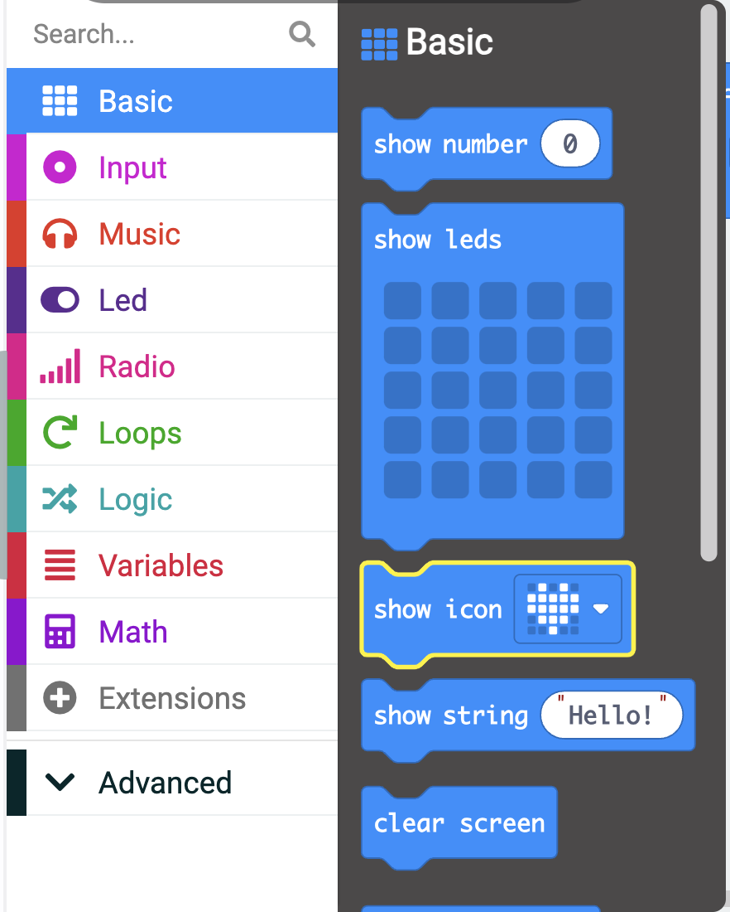
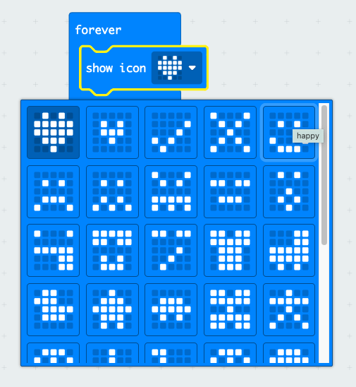
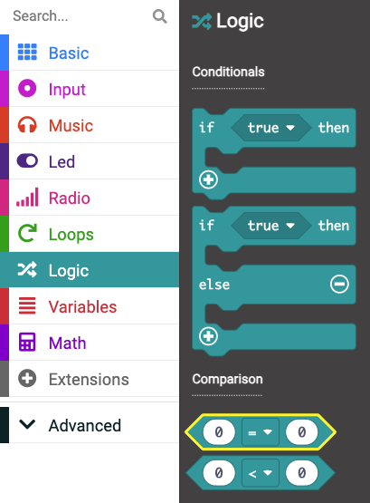
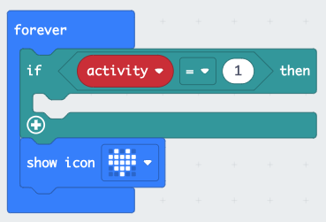
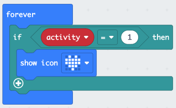

### Rough plan
1. Showcase what they will make - embed?? include instructions on how to use
2. Open MakeCode, tour of the simulator
3. Show Icon - get the micro:bit doing something
4. Choose activities
5. Selection
6. Random choice
7. Clear screen
8. Connect and pair micro:bit

### Opening MakeCode

To get started creating your micro:bit project, you will need to open the MakeCode editor.

--- task ---

Open the MakeCode editor at [makecode.microbit.org](https://makecode.microbit.org)

--- collapse ---

---
title: Offline version of the editor
---

There is also a [downloadable version of the MakeCode editor](https://makecode.microbit.org/offline-app).

--- /collapse ---

--- /task ---

Once the editor is open, you will need to create a New Project and give your project a name. 

--- task ---

Click on the **New Project** button.

--- /task ---

--- task ---

Give your new project the name `hobby-selector` and click **Create**.

**Tip:** Give your project a helpful name that relates to the activity you’re creating. This will make it easier to find if you create other projects on MakeCode.

--- /task ---

### The MakeCode Editor

Created by the micro:bit Foundation, the **MakeCode editor** has everything you need to get started coding on micro:bit. 

On the left side there is a **simulator**, this contains a virtual micro:bit that you can use to test your code! 

It has all the features and buttons found on a V2 micro:bit, including:
+ LED Display
+ Speaker
+ Microphone
+ Input buttons
    + A
    + B
    + Logo

In the centre there is the **blocks panel** which is colour coded and allows you to access various code blocks.

On the right side there is a main **code editor panel** to drag and drop blocks into when creating your program.

### Show Icon

The MakeCode editor panel already contains two blocks: `on start` and `forever`.

You are going to use the `forever` block to see how the LEDs on the simulator work.

--- task ---

Click on the Basic blocks in the Blocks panel. This will expand to show you the groups of blocks available.

Drag the `show icon` block and place it **inside** the `forever` block. 

This should fit in place like a puzzle.

--- /task ---

--- task ---

Click the down arrow on the show icon block and choose any icon of your choice.

In this example we have chosen the `X` icon.

--- /task ---

--- task ---

**Test:** Click the play button on the emulator, the LED display should light up, showing your chosen icon.

Well done for getting the micro:bit to do something!

--- /task ---

### Choose your hobbies. 

--- task ---

Choose 3 hobbies/activities you like to do in your spare time. 

If you can't think of some here are some ideas to  get you started:
+ Gaming
+ Reading
+ Baking
+ Watching TV
+ Going for a walk
+ Playing a sport
+ Drawing

--- /task ---

--- task ---

Change your icon to one that represents your first hobby. 

--- /task ---

### Creating a variable

Create a variable that will be used to decide which activity you do. 

--- task ---

Open the `Variables` block menu, and click **Make a variable**.

--- /task ---

--- task ---

Call your new variable `activity`. 

--- /task ---

You will now see that there are new blocks you can use to call on and change the value stored in the `activity` variable. 

--- task ---

Drag the `set [activity] to 0` block inside of the `onstart` block.

--- /task ---

### Which activity will it be?

Next you are going to add the code that will show which activity the micro:bit has chosen. 

You will use `if... then` blocks to do this. 

--- task ---

Open the **Logic** menu and choose the `if 'true' then` block. 

Drag it inside the `forever` loop block **above** your icon block. 

--- /task ---

Now you are going to make it so that your icon shows only if activity is set to `1`.

--- task ---

Open the **Logic** menu and grab the `0 '=' 0` **condition block**. 

Drag that over the `true` part of your `if` block and place it down. 

--- /task ---

--- task ---

Head back to the **Variables** menu and grab the small block that says `activity`. 

Drag that block to the **first** 0 in your new condition block. 

Change the `0` to a 1.

--- /task ---

--- task ---

Drag your `show leds` block **inside** the `if... then` block. 

--- /task ---

--- task ---

**Test** Run your program, you should see that nothing appears on the LEDs.

**Change** the value in your `set 'activity' to 0` to set the variable to 1.

**Run** the program again and you should see the icon appear. 

**Make sure to change activity back to `0` afterwards.**

--- /task ---